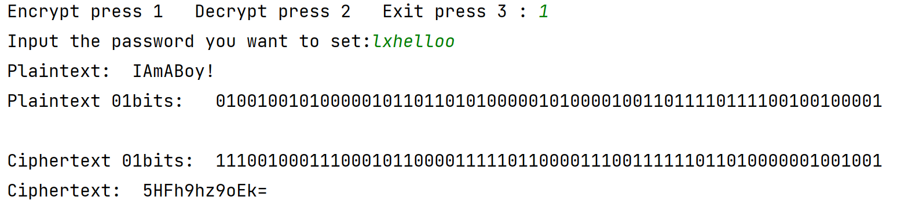
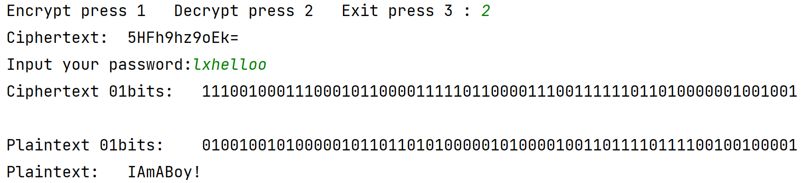

# 🔐 **DES 加密与解密程序**

## 🌐 Language Navigation
- [中文版本 (Chinese Version)](README.md)
- [English Version](README_EN.md)

> **华中师范信管学院数据隐私与信息安全课程DES算法实验**  
> 本项目仅为本人尝试掌握经典 DES 加密算法，本人不为本项目用于其他用途承担任何风险，本人只用作交流学习。欢迎各位数据安全爱好者或者加密技术学习者的砸砖。

## 📑 **目录**
- 🚀 [项目简介](#项目简介)
- 🔍 [DES 原理](#des-原理)
  - ❓ [什么是 DES？](#什么是des)
  - 🔐 [DES 加密流程](#des-加密流程)
- 🗂 [项目结构](#项目结构)
- ✨ [主要功能](#主要功能)
- 📦 [安装与使用](#安装与使用)
- 🛠 [使用示例](#使用示例)
- ⚠️ [注意事项](#注意事项)

---


## 项目简介
该项目实现了 **数据加密标准（DES）** 算法，它是对称加密算法的经典代表，用于安全传输数据。程序支持对文本的加密和解密操作，同时提供了 Base64 编码和解码功能，确保加密后的数据能够被存储或传输。

---

## DES 原理

### 什么是DES？
**DES (Data Encryption Standard)** 是一种对称密钥加密算法，由美国国家标准技术研究院 (NIST) 提出，广泛用于加密金融等敏感数据。DES 使用 64 位的密钥对 64 位的明文进行分组加密，并生成相应的密文。

**加密方式**：对称加密  
**密钥长度**：64 位（其中 8 位为校验位）  
**加密过程**：16 轮 Feistel 迭代网络

### DES 加密流程

1. **初始置换 (IP)**：明文在加密之前进行位转换。
2. **分组与密钥生成**：将 64 位的明文分成左右两部分 (L 和 R)，并生成 16 轮子密钥。
3. **16 轮迭代**：
   - 扩展右半部分 R，得到 48 位数据。
   - 使用子密钥对数据进行异或。
   - 通过 S 盒进行置换，将数据从 48 位压缩回 32 位。
   - 与左半部分 L 进行交换。
4. **逆初始置换 (IP-1)**：最终得到 64 位的密文。

> **图示：**
> 
> ```plaintext
> +-----------------+      +-------------------+      +-------------------+
> |     明文输入     | ---> |     初始置换 (IP)  | ---> |    16 轮加密处理    |
> +-----------------+      +-------------------+      +-------------------+
>                                                      |
> +-----------------+      +-------------------+      |
> |   逆初始置换 (IP-1)  | <--- |     密文输出     | <--- |
> +-----------------+      +-------------------+      +-------------------+
> ```

---

## 项目结构
- `DES_BOX.py`：包含 DES 算法的常量定义，包括初始置换表、S 盒、P 置换表等。
- `main.py`：核心加密解密逻辑与用户交互程序。

---

## 主要功能

### 📝 文件读写
- **`read_file(filename)`**：从指定的文本文件中读取明文。
- **`write_file(message)`**：将加密后的密文写入 `ciphertext.txt` 文件。

### 🔐 Base64 编码与解码
- **`base64_encode(bit_string)`**：将二进制字符串转换为 Base64 编码，便于文本存储和传输。
- **`base64_decode(encoded_string)`**：将 Base64 编码还原为二进制字符串。

### 🔑 密钥与明文处理
- **`process_key(key)`**：处理输入的密钥字符串，生成 64 位密钥。
- **`str_bit(message)`**：将明文字符串转换为二进制位字符串。
- **`divide(bits, bit)`**：将二进制流按 64 位进行分组，以便加密。

### 🔒 DES 加密与解密
- **`des_encrypt(bits, key)`**：对 64 位的明文块进行 DES 加密，返回密文。
- **`des_decrypt(bits, key)`**：对 64 位的密文块进行 DES 解密，返回明文。
- **`all_des_encrypt(message, key)`**：对整个明文进行分组加密，返回完整密文。
- **`all_des_decrypt(message, key)`**：对整个密文进行分组解密，返回原始明文。

---

## 安装与使用

### 环境要求
- 这是我自己使用的环境
- **Python 3.11** 
- 无需安装额外库，`base64` 是 Python 标准库。

### 使用步骤

1. 将明文存入 `plaintext.txt` 文件。
2. 运行程序，选择加密或解密操作：
   - 输入 `1` 进行加密：输入密钥后，程序将输出加密后的密文，并将其写入 `ciphertext.txt` 文件。
   - 输入 `2` 进行解密：输入密钥后，程序将解密密文并输出原始明文。
   - 输入 `3` 退出程序。

```bash
# 运行命令
python DES_Python.py
```
---

## 使用示例

### 加密操作
1. 将以下文本保存为 `plaintext.txt`：
   ```
   IamABoy!
   ```
2. 运行程序并选择加密操作：
   ```
   Encrypt press 1   Decrypt press 2   Exit press 3 : 1
   Input the password you want to set: lxhelloo
   ```

   **输出结果**：

   
   ```
   Encrypt press 1   Decrypt press 2   Exit press 3 : 1
   Input the password you want to set:lxhelloo
   Plaintext:  IAmABoy!
   Plaintext 01bits:   0100100101000001011011010100000101000010011011110111100100100001

   Ciphertext 01bits:  1110010001110001011000011111011000011100111111011010000001001001
   Ciphertext:  5HFh9hz9oEk=
   ```
   - 显示明文的二进制表示。
   - 显示生成的密文（Base64 编码）。
   - 密文保存在 `ciphertext.txt` 中。

### 解密操作
1. 运行程序并选择解密操作：
   ```
   Encrypt press 1   Decrypt press 2   Exit press 3 : 2
   Input your password: lxhelloo
   ```

   **输出结果**：
   

   ```
   Encrypt press 1   Decrypt press 2   Exit press 3 : 2
   Ciphertext:  5HFh9hz9oEk=
   Input your password:lxhelloo
   Ciphertext 01bits:   1110010001110001011000011111011000011100111111011010000001001001
   
   Plaintext 01bits:    0100100101000001011011010100000101000010011011110111100100100001
   Plaintext:   IAmABoy!
   ```
   - 显示解密后明文的二进制表示。
   - 输出原始明文内容。

---

## 注意事项
- 密钥必须为 8 个字符，程序自动处理校验位。
- 明文长度不满 64 位时将自动填充 0。
- 加密与解密必须使用相同的密钥，否则解密结果将不正确。
- 请确保密文存储的文件 (`ciphertext.txt`) 经过 Base64 编码，便于读取与传输。

---


## 📝 许可证

本项目采用 **MIT License** 许可证。  
请阅读以下详细条款，了解您的权利与义务：


MIT License

Permission is hereby granted, free of charge, to any person obtaining a copy
of this software and associated documentation files (the "Software"), to deal
in the Software without restriction, including without limitation the rights
to use, copy, modify, merge, publish, distribute, sublicense, and/or sell
copies of the Software, and to permit persons to whom the Software is
furnished to do so, subject to the following conditions:

The above copyright notice and this permission notice shall be included in all
copies or substantial portions of the Software.

**THE SOFTWARE IS PROVIDED "AS IS", WITHOUT WARRANTY OF ANY KIND, EXPRESS OR
IMPLIED, INCLUDING BUT NOT LIMITED TO THE WARRANTIES OF MERCHANTABILITY,
FITNESS FOR A PARTICULAR PURPOSE AND NONINFRINGEMENT. IN NO EVENT SHALL THE
AUTHORS OR COPYRIGHT HOLDERS BE LIABLE FOR ANY CLAIM, DAMAGES OR OTHER
LIABILITY, WHETHER IN AN ACTION OF CONTRACT, TORT OR OTHERWISE, ARISING FROM,
OUT OF OR IN CONNECTION WITH THE SOFTWARE OR THE USE OR OTHER DEALINGS IN THE
SOFTWARE.**